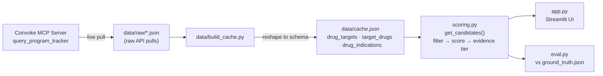

# Target-Bridge

Built at Biopharma Hack Day (AWS Builder Loft SF), Aug 13, 2026 — problem statement: **"Repurposing Opportunities."**

## What it does

Given a drug, Target-Bridge finds its biological target(s), finds every *other* drug that acts on the same target(s), and surfaces the diseases those other drugs are being trialed for that the original drug **isn't** yet trialed for — ranked by trial phase and how much independent cross-drug evidence backs each one. Every candidate traces back to a real clinical trial (NCT ID, linked to ClinicalTrials.gov).

The core idea: when two drugs share a molecular target, a disease one of them is already succeeding in is a data-driven hint the other might work there too. Real-world precedent: **semaglutide**, a GLP-1R agonist approved for diabetes, turned out to also work for obesity and cardiovascular risk reduction — exactly the kind of jump this tool is built to surface *before* it's common knowledge.

## Data source

All drug/target/indication/trial data is pulled live from **Convoke's biopharma Program Tracker** (via MCP), covering 10 drugs:

- **Core set**: Brenipatide, Semaglutide, Tirzepatide, Liraglutide, Dulaglutide, Retatrutide, Sildenafil, Minoxidil
- **Added for extra validation**: Bremelanotide, Octreotide

Raw pulls live in `data/raw/`; `data/build_cache.py` reshapes them into `data/cache.json`, the lookup-map structure `scoring.py` reads from (`drug_targets`, `target_drugs`, `drug_indications`).

## Architecture



Data flows one direction: live MCP pulls are cached to disk once (to stay within the API credit budget), reshaped into a lookup-map schema, and everything downstream (`scoring.py`, `app.py`, `eval.py`) reads from that cache rather than hitting the API again. Re-running `data/build_cache.py` is free — no MCP calls, just reshaping JSON already on disk.

## How it works

1. **Look up the query drug's target(s)** — e.g. Semaglutide → GLP-1R.
2. **Find every other drug sharing that target** — e.g. Tirzepatide, Liraglutide, Retatrutide, Exenatide, ...
3. **Pull those drugs' indications**, excluding anything the query drug is already trialing, and anything discontinued/terminated/withdrawn.
4. **Score** each candidate: Approved=5, Phase 3=4, Phase 2=3, Phase 1=2, Preclinical=1, plus a small recency bonus for recent catalyst events.
5. **Tag procedural/diagnostic-only matches** (e.g. a drug used to relax gut muscle during an imaging scan) — these share a target on a technicality, not real disease biology, so they're capped at the lowest score tier and flagged, not treated as genuine repurposing signal.
6. **Compute Evidence Strength** for each candidate indication by aggregating across *all* drugs that support it:
   - 🟢 **High** — 2+ independent drugs on the same target already have this indication
   - 🟡 **Moderate** — exactly 1 supporting drug, but at Approved/Phase 3
   - 🔴 **Low** — 1 supporting drug at an earlier phase, or a procedural/diagnostic match

## Validation

`eval.py` runs the pipeline against 5 known historical repurposing cases in `ground_truth.json`, each restricted back to the drug's *original* (pre-repurposing) indication so the eval isn't just re-discovering what the drug is already known for.

**Current hit rate: 40% (2/5)**
- ✅ Semaglutide → Obesity (rank 5) — real cross-drug precedent
- ✅ Octreotide → Carcinoid Syndrome (rank 7) — confirmed via two independent drugs (Lanreotide, Paltusotine)
- ❌ Brenipatide, Exenatide, Bremelanotide — each is the *only* drug in our current dataset with its specific known-new-indication. The algorithm correctly never recommends a drug's own real-world discovery back to itself; a hit requires a second drug in the target-sharing pool to already show that indication, and none currently does for these three. This is a data-coverage limit (we queried a curated slice of Convoke's graph, not the full database), not an algorithm bug.

## Running it

```bash
pip install -r requirements.txt
streamlit run app.py       # UI, at localhost:8501
python3 eval.py            # historical-case validation
python3 data/build_cache.py  # rebuild data/cache.json from data/raw/*.json
```

## Project structure

```
app.py                  Streamlit UI
scoring.py               Candidate generation, filtering, scoring, evidence tiering
eval.py                  Runs the pipeline against ground_truth.json
ground_truth.json        Known historical repurposing cases
data/
  build_cache.py         Raw MCP JSON -> data/cache.json
  cache.json              Generated lookup-map cache (drug_targets, target_drugs, drug_indications)
  raw/                    Raw Convoke Program Tracker API responses
```

## Known limitations

- **Data coverage is a curated slice**, not the full Convoke graph — pulled to stay within an API credit budget. Some real repurposing precedent likely exists outside what we pulled (see Validation above).
- **Minoxidil** shows no candidates: Convoke tags its target as "AR" (androgen receptor), which pulled back unrelated prostate-cancer drugs — a knowledge-graph tagging artifact, not real shared biology with minoxidil's actual mechanism (a KATP channel opener). We chose not to show that noise rather than present a misleading candidate list.
- **Multi-target drugs** (e.g. Brenipatide, hitting both GIPR and GLP-1R) were queried with all their targets batched into one API call to save credits, so a candidate can't always be attributed to the *specific* target it shares — only that it shares at least one. This never produces a false candidate, just occasionally imprecise rationale text.

## Team

Three-person build: MCP data layer, scoring/eval/app, and historical case validation.
